<textarea id="source">

<h1 class="slide-header">Version Control with Git</h1>

<span id=time-estimate class="color-grey-500">30 mins</span>

<p id="lesson-description">
  Making and saving changes to code might feel like playing a high-stakes game — one wrong move and it’s all over. But this actually isn’t true at all. Thankfully, enough developers have suffered through rewriting code that they invented the tools like Git to prevent such scenarios from ever happening.
</p>

<h5 id="topics-header" class="color-grey-500">Topics</h5>

Version Control

<hr>

Common Git Commands

<hr>

---

<h1 class="slide-header">Learning Objectives</h1>

<p>By the end of this lesson, you'll be able to:</p>

<ul>
  <li>Explain why Git is an important tool for developers. </li>
  <li>Use several of the most common Git commands.</li>
  <li>Describe the phases of Git tracking.</li>
</ul>

---

<h1 class="slide-header">Git on the CLI</h1>

At this point, you’re capable of navigating your file structure and interacting with your computer via the Command Line.

This is an important skill for a developer to have, but we should expand a bit on the developer-specific capabilities the CLI offers. In particular, the ability to share and manage the codebase of programming projects using `git`.

Let’s dive in.

---

<h1 class="slide-header">Version Control</h1>

You’re on your computer plugging away at a research project, and it’s all going well. You make some changes and hit “Save.” Then you realize: Those last changes you made? They were all wrong. You need to undo them, but you can’t. The previous version is already gone for good.

You might already have a system in place for avoiding such a mishap — maybe you save your document multiple times under different names so you can return to a previous stage of the project. Smart!

Developers call this process **version control**.


---

<h1 class="slide-header">Let's Drive That Home</h1>

This kind of capability may be a foreign concept, as most of us get by without version control in other industries; however, version control is non-negotiable for developers.

Why?

Development is an iterative process with a lot of dependencies. Imagine if a sentence you wrote on the first page of that research paper impacted a sentence on Page 15 — as in, ruined it.

Lines of code do not live independently like sentences in a document. Any line of code that is added or removed could make major changes to the program as a whole. Hence, the emphasis on version control for developers.

---

<h1 class="slide-header">Getting On Board with Git</h1>

Software developers have created a number of tools to solve this version control problem for their own projects: Subversion, CVS, Perforce, and many others.

In fact, some companies, like Google, have developed their own special kinds of version control.

In this course, we’ll focus on one particularly popular program that's accessed via the Command Line Interface called **Git**.

Git offers a variety of advantages to its users, including:

- Rolling back changes.
- Rolling forward changes.
- Mitigating competing versions of the same file.
- Tracking changes for multiple files.
- Recording only the _changes_ made rather than saving entire separate versions of each file.
- And many more...

---

<h1 class="slide-header">Installing Git</h1>

If you don’t already have Git, you can install it by following directions provided on <a href='http://git-scm.com/download/mac' target='_blank' rel='noopener noreferrer'>git-scm.com</a>.

First, you'll install a tool called Homebrew if you haven't already. Then, Homebrew will help you install Git. All of this will take place in your terminal window.

If you’re following along on Windows and installed Git Bash, Git should have been installed along with it, so you’re all set.

You can check to see if this installation worked by opening up the terminal window and typing:

```
 git --version
```

This will show you what version of Git is running. Your computer should return something greater than or equal to `2.10.1`.

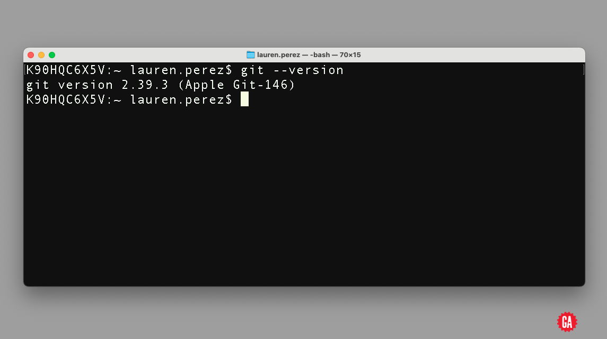

---

<h1 class="slide-header">Let's Dive In</h1>

For the remainder of the lesson, we recommend following the flow outlined below:

- Read about the concepts on the slides.
- Watch animations of what to expect.
- Try it out on your own in the terminal.

This kind of hands-on practice is crucial. After all, we’re pretty certain no one learned to ride a bike just by reading a how-to.

When you see this icon, it means, “Go test it out yourself and come back when you’re done.”


---

<h1 class="slide-header">The Project at Hand</h1>

You were just hired to manage all of the blog content for a media company called Gorilla Army.

To start, create a directory on your desktop called `GA-Blog`.

To take advantage of Git superpowers, we have to add a hidden directory called `.git/` to our project directory, which contains all of the data Git needs to operate. This is called “initializing.”

Next, navigate to the `GA-Blog` directory you just created and run this command:

```
$ git init
```

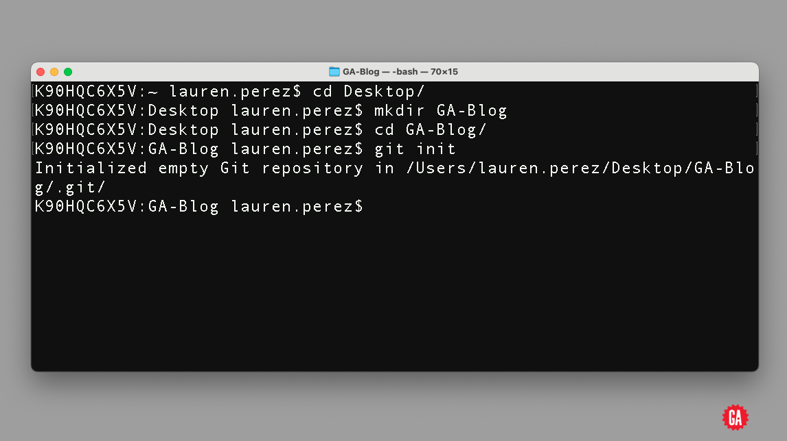

---

<h1 class="slide-header">Go Try</h1>

Run `$ git init` in the `GA-Blog` directory you just created.


**Caution**: Do not execute this command in your **home directory**! It’ll make working with any other repositories very difficult. Use `pwd` to check your location if you’re unsure.

---

<h1 class="slide-header">Can't Find It?</h1>

If you navigate to your `GA-Blog` directory in the GUI, you won’t see any additional files. This is because hidden files aren’t visible on your computer by default. To see the `.git/` directory, you need to run `ls -a` from the command line.

---

<h1 class="slide-header">Status Update</h1>

Because you just started at Gorilla Army, your `GA-Blog` directory is empty. We can confirm this by running `git status`, which asks Git to give us an update on our project’s status.

```
$ git status
```

We should get a response like this:

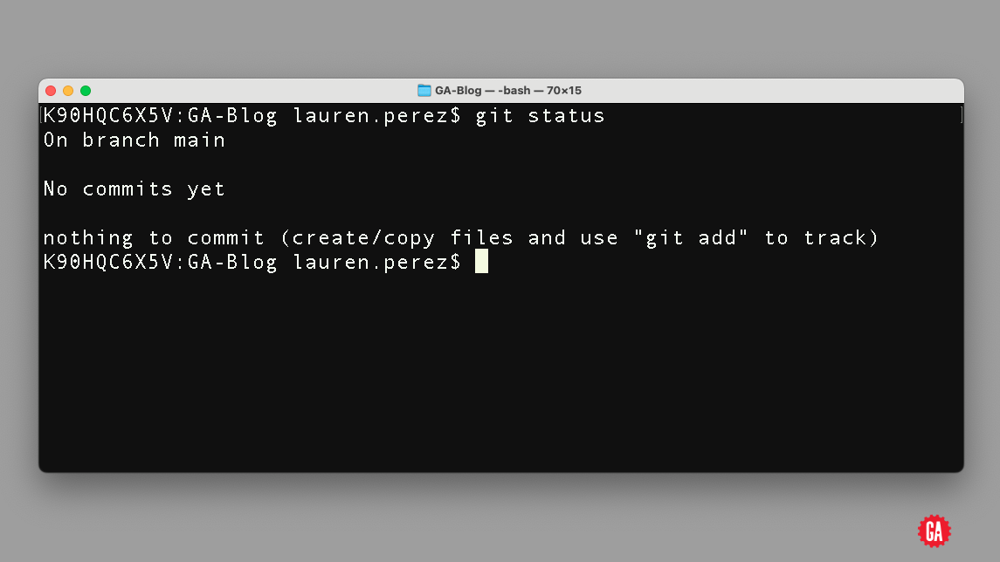

Each save we make to our repository is called a **commit**; this message is telling us that our project has no unsaved changes.

---

<h1 class="slide-header">Your Turn</h1>

Go run `$ git status` in your `GA-Blog` directory.


---

<h1 class="slide-header">Make a File</h1>

To create a new text file called you'll use the `touch` command:

```
$ touch post.txt
```

Then, check the status again. Git has identified that a change has been made: There is now a file in your repository.

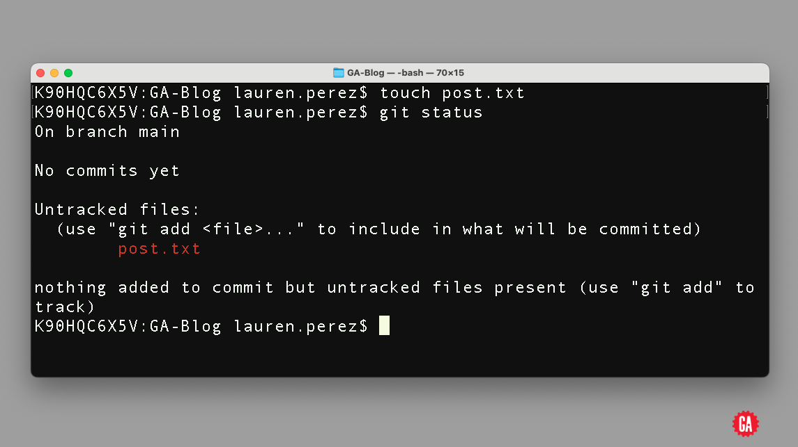

---

<h1 class="slide-header">Your Turn</h1>

Create a new text file called `$ touch post.txt` inside of `GA-Blog` and check the status again.


---

<h1 class="slide-header">Staging</h1>

Like the terminal, Git doesn’t make any assumptions about what changes you want to save and when you want to save them. Instead, you need to explicitly tell it what to do.

To add this change to your next commit, you'll use the `git add` command.

```
$ git add post.txt
```

The command is `add`, but we describe the operation by saying that the file has been “staged.” In other words, it has been added to the list of changes that will be officially saved with our next commit.

The files on this list aren’t final, and any of these changes can be removed, or “unstaged.”

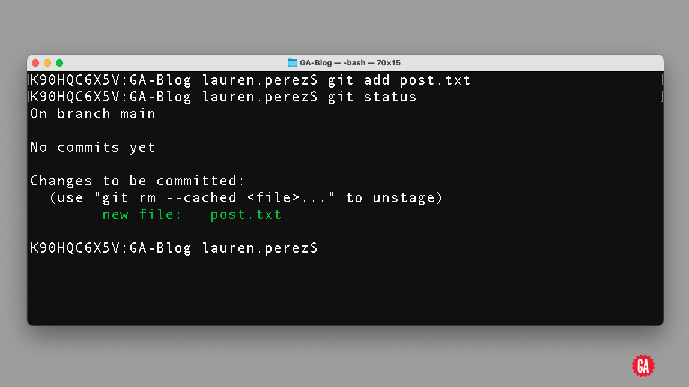

---

<h1 class="slide-header">Try it Out</h1>

Add the change to your next commit using the `git add` command.

```
$ git add post.txt
```


---

<h1 class="slide-header">Status Update</h1>

If we run `git status` again, we’ll see that the addition of `post.txt` is staged and ready to be committed, like this:


---

<h1 class="slide-header">Your Turn</h1>

Run `git status` again.


---

<h1 class="slide-header">For Efficiency's Sake</h1>

Sometimes, you’ll want to save all of the changes to files that have been made inside your repository.

Instead of specifying each file, you can write `git add .`, which will add all of the files in the working directory to the next commit.

Proceed with caution when using `git add .`, as you could accidentally add files with sensitive information.

---

<h1 class="slide-header">It's Not Saved Yet</h1>

Once we’re ready to officially record this version of our project, type:

```
$ git commit -m "created a new post.txt file"
```

The `-m` option allows you to include a message that describes the changes you made for your collaborators or future you.

These should be short but descriptive and clearly indicate what changes each commit makes to the project.

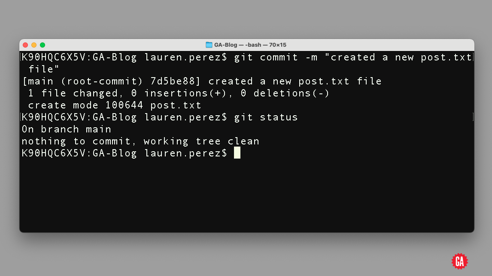

Note: In some versions of Git CLI, you will be asked to provide configuration details before committing. <a href="https://git-scm.com/book/en/v2/Customizing-Git-Git-Configuration" target="_blank" rel="noreferrer noopener">Here</a> is a link to additional Git configuration directions.

---

<h1 class="slide-header">Let's Run That Back</h1>

Git allows you to add changes to your project in the local repository with two steps:

```
$ git add <your-file-name>
$ git commit -m "message"
```

This might be a strange concept to non-developers who are used to clicking a save icon and moving on. For developers, a two-step save process provides benefits, such as making incremental edits to a challenging build and reviewing each file before committing it.

If you’re curious, you can read more about how developers use the two-step saving process to their advantage <a href="https://softwareengineering.stackexchange.com/questions/69178/what-is-the-benefit-of-gits-two-stage-commit-process-staging" target="_blank" rel="noreferrer noopener">here</a>.

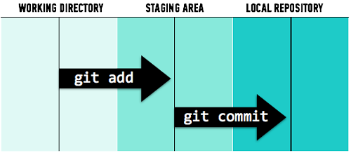

---

<h1 class="slide-header">Commit History</h1>

Further into a project, after you’ve made many commits, you might want to look back and see a timeline of those changes.

Git allows developers to view a list of commits, the submission date, the author, the commit message, and a unique number that identifies the commit, called an **SHA**.

---

<h1 class="slide-header">The Commit History</h1>

To view the timeline of changes, you can run:

```
$ git log
```

This will yield a list of entries that looks like this:

```
commit 7d5be88672611f7320073199f450e108876aca49 (HEAD -> main)
Author: Lauren Perez <lauren.perez@generalassemb.ly>
Date:   Tue Mar 18 15:34:29 2025 -0700

    created a new post.txt file
```

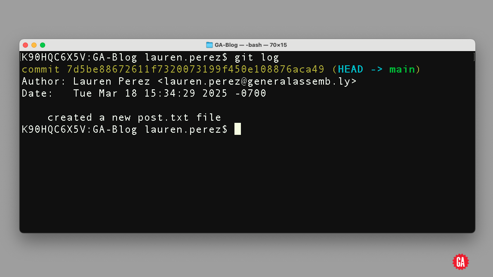

---

<h1 class="slide-header">Try it Out</h1>

Run `git log` to see a timeline of the changes you've made.


---

<h1 class="slide-header">Putting it All Together</h1>

- Open your terminal and navigate to the directory you’ve been using to store information about this course. If you don’t have one yet, make one.
- Create a directory inside of that called `git-practice`.
- Navigate into that new directory. You can make sure you’re in the right place using the `pwd` command.
- Use `git init` to create a Git repository in the `git-practice` directory.

**Note**: Before running `git init`, make sure you’re not already inside another Git repository. Type `git status`. If you see `fatal: Not a git repository (or any of the parent directories): .git`, then you know you’re good to go and you can safely run `git init` within this folder.

---

<h1 class="slide-header">Putting it All Together: Add and Commit</h1>

- Staying in the `git-practice` directory, run the `ls -a` command to see the `.git` directory you’ve just created.
- Create a new file called `README.txt` and run `git status`. What output do you get?
- Use the `git add README.txt` command to add the new file to the staging area.
- Run `git status` again. **How has the output changed?**
- Now, commit the changes you made using `git commit -m "..."`. Give the commit an appropriate message. Remember, it should be short but descriptive.

You did it! In due time you’ll be able to complete this process with your eyes closed (although we don’t recommend it).

---

<h1 class="slide-header">Local vs. Remote</h1>

So far, we’ve been making changes locally by editing files and repositories on our computers. That’s all well and good, but what if we want to collaborate with others or back up our files just in case our computer dies? For that, we need to connect our local repository to a remote one.

Enter GitHub.

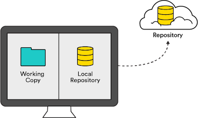

---

<h1 class="slide-header">What is Github?</h1>

GitHub is a company that’s famous for the platform it built to manage Git repositories in the cloud.

On GitHub, developers can share their code, comment on it, and review changes. It’s an implementation of the same Git software you installed on your computer, but it also comes with some additional features.

In a lot of ways, GitHub is like Dropbox.

You have a folder in the cloud — your remote repository — that syncs with your computer. You can share this remote repository with others, grant them special permissions, and view different versions of your files.

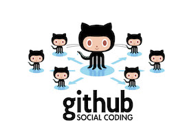

---

<h1 class="slide-header">So, How Do Developers Do This?</h1>

Consider a project like Node.js, a JavaScript framework. Node.js is completely open source, which means that anyone can read (and even copy) the code that makes it work — including you!

The source code is publicly available <a href="https://github.com/nodejs/node" target="_blank" rel="noreferrer noopener">here</a> on GitHub. If you visit the main repository, you’ll see that there are more than 2,000 contributors who have committed changes to Node.js.

Although it’s open source and anyone can read or contribute to its code, Node.js is maintained by a company called Joyent. These contributors don’t have the ability to edit the original Joyent repository — that wouldn’t be very efficient or safe. Someone could accidentally make a change that conflicts with someone else’s contributions, causing the code to break. Changes need to be inspected and approved by Joyent before they can officially be added to the project.

---

<h1 class="slide-header">The Github Workflow</h1>

The workflow for contributing to an open-source product or your dev team’s project comprises the following steps:

1. Forking
2. Cloning
3. Editing
4. Adding/committing
5. Pushing
6. Submitting a pull request

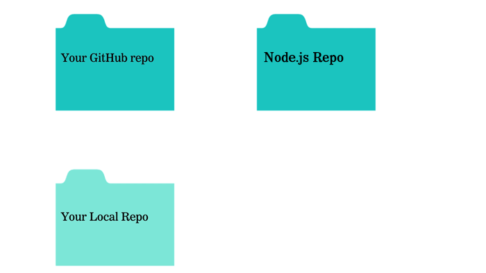

---

<h1 class="slide-header">Forking</h1>

To add a copy of someone else’s GitHub repository to your GitHub account, fork it by clicking the Fork button in the upper right-hand corner.

This forked repository is not perfectly identical, but it includes all of the same source files, issues, and commit history.

By forking Joyent’s repository, for example, you now have a full working copy of the Node.js source code to play with. This way, when you break something (which you will), the main repository won’t be affected.

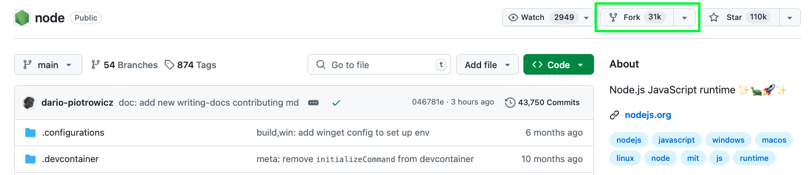

---

<h1 class="slide-header">Cloning</h1>

To make a local copy of a fork, you’ll clone the repository. This will save the code on your machine so you can edit it.

To do so, open your terminal, navigate to where you’d like to store the repository, then type:

```
git clone https://url-to-clone
```

You can find the URL to clone by clicking the green button that says “Clone or download.”

**Hint**: If you’re following along in Git Bash on Windows, the commands to copy and paste a repository are a little different than the default Windows copy/paste commands. Use `control + insert` to copy and `shift + insert` to paste.

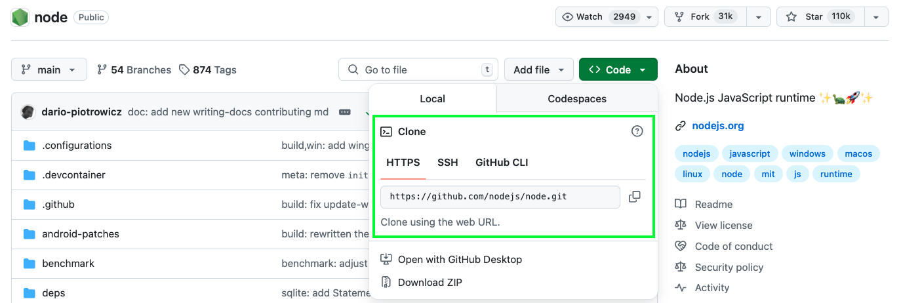

---

<h1 class="slide-header">Adding and Committing</h1>

Once you've cloned a project, you're free to make changes on your computer and manage your **local** version of it: the one living in your computer.

Remember, you’re editing the code on your _local_ copy of the repository. We know that any time we do this, we need to use our normal git commands so that our local copy is protected if we goof up.

Recall these commands:

```
$ git add <your-file-name>
$ git commit -m "message"
```

---

<h1 class="slide-header">Pushing From Local to Remote</h1>

Once you’ve committed these changes, your local repository will differ from your remote repository.

To update your remote repository on GitHub, you have to **push** those changes using the `git push origin master` command.

You don't need to worry about the `origin` and `master` part just yet. However, if you’re curious, here’s a brief overview:

- `origin` is a shortcut for the URL of your default remote repository (in this case, the repository on GitHub). You can have many remotes if you want, but we’re only going to work with one for now.
- `master` refers to the **branch** on your remote repository where you are currently adding your changes. Again, for now, we’re just going to be working on the `master` branch.


---

<h1 class="slide-header">Submitting a Pull Request</h1>

At this point, your local and remote repositories contain the changes you’ve made. If you want to share these changes with the original repository owner, Joyent, you can submit a **pull request**.

A pull request effectively says, “Hello, maintainer of Project X. I made some changes here in my forked copy, and I think they’re good ones. You should add them to your repository.”

Pull requests are a GitHub feature, so you’ll need to head back to the browser to submit them.

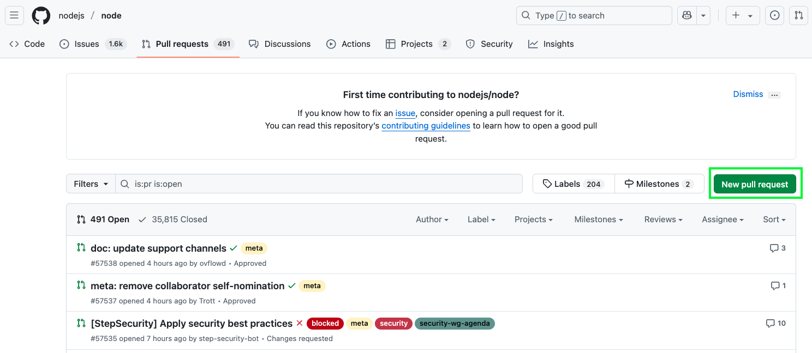

---

<h1 class="slide-header">Terms Review</h1>

That was a lot of new terms, so let's review the main commands involved with tracking work between local and remote repositories:

<details>
  <summary>clone</summary>
  Downloads a repository hosted on a remote server (like github) onto your local machine
</details>

<details>
  <summary>push</summary>
  Moves changes that you've made locally, on your own machine, to the remote version of the repository.
</details>

<details>
  <summary>pull</summary>
  Sets up a request for a repository owner to combine your personal version with the main version of a repository.
</details>

<details>
  <summary>local</summary>
  Your own computer.
</details>

<details>
  <summary>remote</summary>
  A server hosted somewhere other than your own computer, typically Github or other web-hosted service.
</details>

---

<h1 class="slide-header">Knowledge Check</h1>

In which step of the GitHub workflow do you initiate a transfer of information **from** your local repository **to** your remote repository?

<fieldset>
    <legend>Please select one of the following</legend>
<input type='radio' name='answers' id='answer1' value='answer1'/><label for='answer1'>fork</label><br />
<input type='radio' name='answers' id='answer2' value='answer2' /><label for='answer2'>clone</label><br />
<input type='radio' name='answers' id='answer3' value='answer3'  correct='true' /><label for='answer3'>push</label><br />
<input type='radio' name='answers' id='answer4' value='answer4' /><label for='answer4'>pull</label><br />
</fieldset>
<button class='ant-btn ant-btn-primary multiple-choice-radio-submit'>Submit Answer</button>

---

<h1 class="slide-header">Conclusion</h1>

Well done! You really committed to that lesson.

By now, you should be able to do the following:

- Explain why Git is an important tool for developers.
- Use several of the most common Git commands.
- Describe the phases of Git tracking and syncing between remote and local repositories

Check out these resources from Git:

- <a href="https://git-scm.com/book/en/v2/Getting-Started-About-Version-Control " target="_blank" rel="noreferrer noopener">Version Control: Getting Started</a>
- <a href="https://git-scm.com/book/en/v2/Git-Basics-Getting-a-Git-Repository" target="_blank" rel="noreferrer noopener">Git Basics</a>

<a href="https://softwareengineering.stackexchange.com/questions/69178/what-is-the-benefit-of-gits-two-stage-commit-process-staging" target="_blank" rel="noreferrer noopener">Read</a> how developers use the two-step saving process to their advantage.

</textarea>
