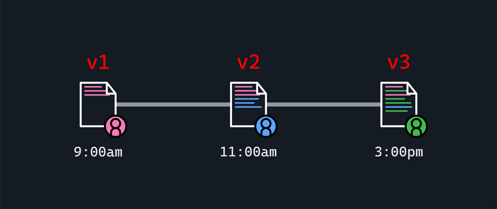
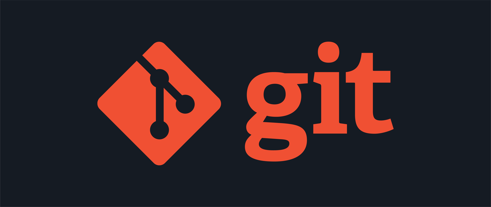
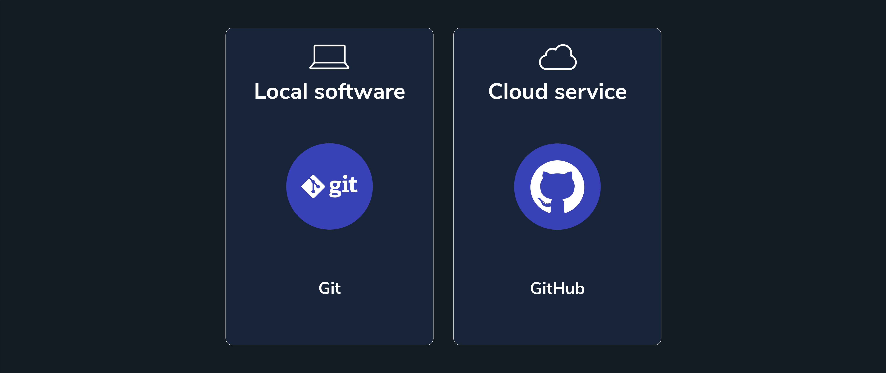
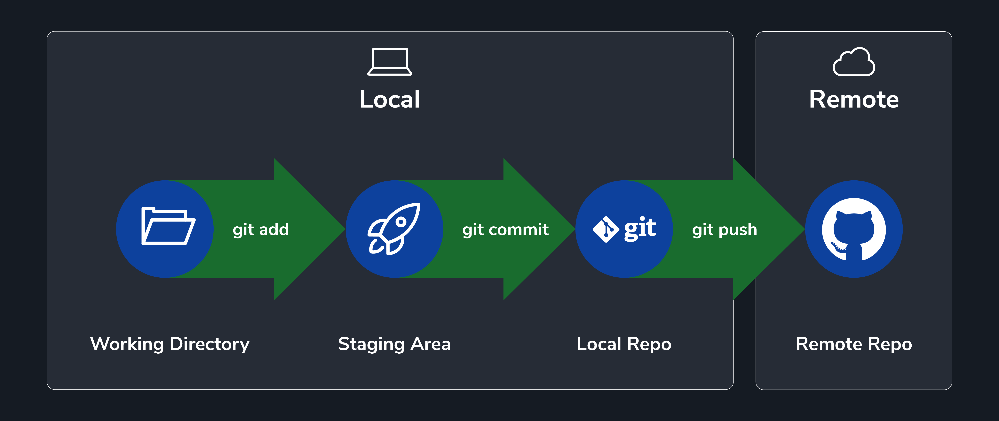
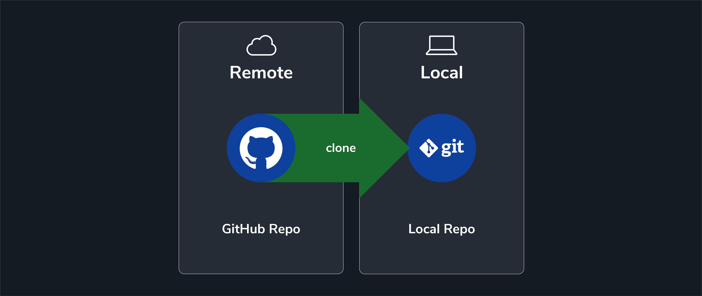

<textarea id="source">

<h1 class="slide-header">Version Control with Git</h1>

<span id=time-estimate class="color-grey-500">30 mins</span>

<p id="lesson-description">
Making and saving changes to code can feel intimidating — you might worry that one mistake could ruin everything.

But the good news is: developers have created tools to help prevent that from happening.

One of the most important tools is <strong>Git</strong>, which allows you to track changes, save versions of your work, and go back to previous versions if something goes wrong.

In this lesson, you’ll learn how Git helps developers work confidently and safely.

</p>

<h5 id="topics-header" class="color-grey-500">Topics</h5>

What is Version Control?

<hr>

Common Git Commands and Tracking Changes

<hr>

Working with Local and Remote Repositories on GitHub

---

<h1 class="slide-header">Learning Objectives</h1>

<p>By the end of this lesson, you'll be able to:</p>

<ul>
  <li>Explain what Git is and why developers use it.</li>
  <li>Use several of the most common Git commands to track and save changes.</li>
  <li>Describe the different stages of how Git tracks changes (unstaged, staged, committed).</li>
  <li>Understand the basic relationship between local repositories and remote repositories on GitHub.</li>
</ul>

---

<h1 class="slide-header">Git on the CLI</h1>

By now, you know how to navigate your computer and work with files using the **command line interface (CLI)**.

This is a key skill for any developer. But the CLI can do more than help you move around your computer — it also allows you to **share and manage code** for programming projects using a tool called **Git**.

In this lesson, we’ll learn how developers use Git on the command line to keep track of their work and collaborate with others.

Let’s get started!

---

<h1 class="slide-header">Version Control</h1>

Imagine you’re working on a big project and everything is going well. You make some changes and click **Save**. Then suddenly, you realize those last changes were mistakes — and you can’t go back to how it was before.

You might already use a simple method to avoid this problem, like saving different copies of a document with names like `project-v1`, `project-v2`, or `project-final`. This helps you return to an earlier version if needed.

**Developers have a name for this process: version control.**

Version control lets you keep a record of all the changes made to a project, so you can easily undo mistakes or return to a previous version when necessary.



---

<h1 class="slide-header">Why Version Control Matters</h1>

In everyday tasks, you might not need version control. But for developers, it is absolutely essential.

Why?

Because **development is a complex, step-by-step process where everything is connected**.

- Imagine writing a sentence on Page 1 of a document that accidentally changes or breaks a sentence on Page 15.
- In code, every line can affect other parts of the program. Removing or changing one line could cause major problems elsewhere.

That’s why developers rely on **version control** to safely track and manage changes in their code. It helps them work confidently, fix mistakes, and keep projects running smoothly.

---

<h1 class="slide-header">Getting Started with Git</h1>

Software developers use special tools to help manage and track changes in their projects.

In this course, we will focus on one of the **most popular version control tools** used by developers around the world: **Git**.



Git is used through the **Command Line Interface (CLI)** and offers many benefits, such as:

- Undoing changes (rolling back).
- Reapplying changes (rolling forward).
- Handling different versions of the same file from multiple people.
- Tracking changes across many files.
- Saving only the changes made, rather than making full copies of each file.
- And much more!

---

<h1 class="slide-header">Installing Git</h1>

If you don’t have Git installed yet, you can download it from <a href='http://git-scm.com/download/mac' target='_blank' rel='noopener noreferrer'>git-scm.com</a>.

**For Mac users:**

- You’ll first install a tool called **Homebrew**, if you do not already have it.
- Homebrew will then help you install Git, all from your terminal window.

**For Windows users:**

- If you installed **Git Bash** earlier, Git should already be included — you’re ready to go!

**How to check if Git is installed:**

1. Open your terminal window.
2. Type the following command and press `Enter`:

```
 git --version
```

You should see a response showing the Git version number. It should be **2.39.0 or higher**.


---

<h1 class="slide-header">Git Configuration</h1>

Before using the software, Git needs to know who you are. You can set up your name and email address using the `git config` command. These details will be attached to all your saved code, so collaborators know who made each change.

In your terminal, type the following commands (replacing the example information with your own name and email):

💻 **In your terminal, type:**

```
git config --global user.name "Your Name"
git config --global user.email yourname@example.com
```

- The `--global` flag means these settings will apply to **all Git projects** on your computer, not just the one you are working on now.
- Make sure to use an email address that you will use (or already use) for your **GitHub account**.
  - If you do not have a GitHub account yet, use an email you plan to sign up with later.

---

<h1 class="slide-header">Let’s Get Hands-On</h1>

From this point forward, here’s the best way to learn and follow along:

1. **Read** the information on each slide carefully.
2. **Look at the images** to understand what the commands and results should look like.
3. **Practice** by typing the commands in your terminal and seeing the results for yourself.

Hands-on practice is one of the best ways to learn!

You can read about commands, but the real learning happens when you **try them yourself**.

Whenever you see this message-

```
💻 In your terminal, type:
```

It’s your signal to **pause, type the command in your terminal, and see what happens**.

---

<h1 class="slide-header">The Project</h1>

You’ve just been hired to manage all the blog content for a media company called **Global Adventures**.

Let’s start by setting up your project folder.

💻 **In your terminal:**

1. First, navigate to your desktop in the terminal: **`cd ~/Desktop`**
2. Create a new directory called `GA-Blog`: **`mkdir GA-Blog`**
3. Move into the `GA-Blog` directory: **`cd GA-Blog`**

To use **Git** in this folder, we need to **initialize** it. This adds a hidden `.git/` directory that contains everything Git needs to track changes.

💻 **In your terminal, type:**

```
git init
```

This will transform your plain **directory** into a **git repository**.


**Caution**: Do not execute this command in your **home directory**! It’ll make working with any other repositories very difficult. Use `pwd` to check your location if you’re unsure.

---

<h1 class="slide-header">Can't See the <code>.git</code> Folder?</h1>

If you open the `GA-Blog` directory in your computer’s graphical interface, you won’t see any new files.

That’s because the `.git/` directory is hidden by default.

💻 **In your terminal, type:**

```
ls -a
```

**This will show the `.git/` directory along with all other files.**

---

<h1 class="slide-header">Checking the Project Status</h1>

Right now, your `GA-Blog` directory is empty — you haven’t added any files yet.  
You can confirm this by asking Git for a status update.

💻 **In your terminal, type:**

```
git status
```

Git will respond with a message letting you know that there are **no commits yet** and no changes to track.


---

<h1 class="slide-header">Creating a File</h1>

Let’s add a new text file to your project.

💻 **In your terminal, type:**

```
touch post.txt
```

This will create an empty file called `post.txt` inside the `GA-Blog` directory.

**Next, check the status again by typing:**

```
git status
```

**to confirm that Git sees your new file.**


---

<h1 class="slide-header">Staging Changes</h1>

Git won’t automatically save changes for you — you need to tell it which changes to include.

To do this, you **stage** the changes using the `git add` command.

When you stage a file, you are saying: _“I want this file to be part of my next commit.”_

- **Staging** adds changes to a list that will be saved when you commit.
- You can still remove files from this list before committing, so staging is not permanent yet.

💻 **In your terminal, type:**

```
git add post.txt
```

**This will stage the file so it’s ready to be committed.**

---

<h1 class="slide-header">Checking Status After Staging</h1>

If you run `git status` again after using `git add`, you will see that `post.txt` is now **staged** and ready to be committed. It will show up under **“Changes to be committed:”**

💻 **In your terminal, type:**

```
git status
```

**This will confirm that your file is staged and waiting to be committed.**


---

<h1 class="slide-header">Adding All Changes at Once</h1>

Sometimes, you might make changes to several files and want to stage them all at once.  
Instead of adding each file one by one, you can use:

```
git add -A
```

The `-A` means _“add everything that has changed in this directory.”_

⚠️ **Be careful when using `git add -A`**  
It will add **every change** — even files you might not want to include (such as temporary files or files with sensitive information).

Always double-check your changes with `git status` before using this command.

---

<h1 class="slide-header">Saving Your Changes with a Commit</h1>

Once your changes are staged and you’re ready to save this version of your project, it’s time to **commit**.

💻 **In your terminal, type:**

```
git commit -m "created a new post.txt file"
```

- The `-m` option lets you write a short message describing what this commit does.
- Commit messages should be clear, short, and explain what changes you made.


💡 **Note:** If your Git setup is missing configuration details (like your name or email), Git may ask you to set that up before you can commit.

You can find configuration instructions <a href="https://git-scm.com/book/en/v2/Customizing-Git-Git-Configuration" target="_blank" rel="noreferrer noopener">here</a>.

---

<h1 class="slide-header">How Saving Works in Git</h1>

In Git, saving changes is a **two-step process**:

1. First, you **stage** the file using:

    ```
    git add <your-file-name>
    ```

2. Then, you **commit** the staged changes with a message using:

    ```
    git commit -m "your message here"
    ```

This might feel unusual if you are used to simply clicking “Save” in other programs. But for developers, this two-step process is helpful — it allows you to:

- Make small, careful changes.
- Review what you’re saving before you finalize it.

If you’d like to learn more about why developers prefer this method, you can read more <a href="https://softwareengineering.stackexchange.com/questions/69178/what-is-the-benefit-of-gits-two-stage-commit-process-staging" target="_blank" rel="noreferrer noopener">here</a>.


---

<h1 class="slide-header">What Is Commit History?</h1>

As your project grows and you make more commits, you may want to look back and see all the changes you have made.

Git allows you to view your **commit history**, which shows:

- A list of all commits made so far.
- The author of each commit.
- The date and time each commit was made.
- The commit message.
- A special unique number called an **SHA**, which identifies each commit.

This history helps you understand how your project has changed over time.

---

<h1 class="slide-header">Viewing Your Commit History</h1>

To see a timeline of all your commits, use the `git log` command.

💻 **In your terminal, type:**

```
git log
```

This will show entries that look like this:

```
commit 7d5be88672611f7320073199f450e108876aca49 (HEAD -> main)
Author: First Last <your@email.com>
Date:   Tue Mar 18 15:34:29 2025 -0700

    created a new post.txt file
```

Each entry includes the commit’s **SHA**, the **author**, the **date**, and the **commit message**.


---

<h1 class="slide-header">Putting it All Together</h1>

Let’s practice everything you’ve learned so far:

💻 **Open your terminal and navigate to your desktop:**

```
cd ~/Desktop
```

**Create a new folder called `git-practice`:**

```
mkdir git-practice
```

**Move into the `git-practice` directory:**

```
cd git-practice
```

**Double-check that you are in the right place by running:**

```
pwd
```

**Before you initialize Git:**  
Make sure you are not already inside another Git repository.

**Check by typing:**

```
git status
```

If you see this message:

```
fatal: Not a git repository (or any of the parent directories): .git
```

then you’re in the right place and can safely initialize Git.

**Now, initialize a Git repository in this directory:**

```
git init
```

---

<h1 class="slide-header">Putting It All Together: Add and Commit</h1>

**While inside the `git-practice` directory, run:**

```
ls -a
```

to see the hidden `.git` directory you just created.

**Create a new file called `README.txt`:**

```
touch README.txt
```

**Check the status with:**

```
git status
```

_What does Git tell you about this new file?_

**Add the file to the staging area using:**

```
git add README.txt
```

**Run `git status` again.**

_How has the output changed? What do you see now?_

**Finally, commit the changes with a clear, short message:**

```
git commit -m "add README.txt file"
```

🎉 **You did it!**

With practice, this process will feel natural and easy to remember. (But we still recommend paying close attention each time!)

---

<h1 class="slide-header">Local vs. Remote</h1>

Up to this point, all of the changes we’ve made have been **local** — stored only on your computer.

But what if you want to:

- Work with other people on the same project?
- Save a backup of your code in case something happens to your computer?

To do this, we need to connect our local repository to a **remote** repository — a version of your project that lives online.

This is where **GitHub** comes in.



---

<h1 class="slide-header">What is GitHub?</h1>

**GitHub** is an online platform where developers can store and manage their Git repositories in the cloud.


**On GitHub, you can:**

- **Share** your code with others.
- Comment on and **review** other people’s code.
- Track changes and view the **full history** of a project.

You can think of GitHub as a tool that works alongside the Git software you installed on your computer — but with added features for collaboration and storage.

In many ways, GitHub is like having an online folder (a **remote repository**) that stays in sync with your computer.



---

<h1 class="slide-header">How Do Developers Share and Collaborate?</h1>

Many projects — like **Node.js**, a popular JavaScript tool — are **open source**.  
This means anyone can view the code, and even suggest improvements.

You can visit the **Node.js** source code on GitHub <a href="https://github.com/nodejs/node" target="_blank" rel="noreferrer noopener">here</a>.  
There are thousands of developers who have contributed to this project over time.

But even though the project is open to the public, changes do not go directly into the main project right away.

- The project is carefully managed and reviewed by a core team.
- Before any new code is added, it is inspected and approved by maintainers to make sure it works well and doesn’t cause problems.

At this stage in your learning, it’s just important to understand that **developers use GitHub to collaborate and carefully review changes before they become part of a live project**.

---

<h1 class="slide-header">The Github Workflow</h1>

When developers contribute to shared projects — either open source or with a team — they follow a process designed to make collaboration safe and organized.

Here is a **high-level overview** of that workflow:

1. **Forking** — making a copy of a project under your own GitHub account.
2. **Cloning** — downloading that copy to your local machine.
3. **Editing** — making changes on your local computer.
4. **Adding/committing** — saving those changes with clear messages.
5. **Pushing** — sending your changes from your computer back to GitHub.
6. **Submitting a pull request** — asking the project owner to review and consider adding your changes to the main project.

> Don’t worry if this feels like a lot! You will learn these steps slowly over time. For now, it’s enough to know that **GitHub provides a clear process for developers to contribute and collaborate.**


---

<h1 class="slide-header">Forking</h1>

On GitHub, if you want to make changes to someone else’s project, the first step is to **fork** it.  
Forking creates a copy of the original repository in your own GitHub account.


This copy contains:

- All of the original project’s files
- The commit history
- Open issues

For example, if you fork the Node.js repository, you now have your own version to experiment with. Any changes or mistakes you make will not affect the original project.


At this stage, it’s enough to understand that **forking lets you safely work on your own version of a project.**

---

<h1 class="slide-header">Cloning</h1>

After forking a repository on GitHub, the next step is often to **clone** it.  
Cloning makes a local copy of the project on your own computer so you can edit the files.



To do this, you would navigate to the folder where you’d like to save the repository, and type:

```
git clone https://url-to-clone
```

You can find the repo's URL by clicking the green **Code** button on the GitHub repository page and copying the link shown there.

**This is just an introduction to these concepts. You’ll practice them more in future lessons!**


---

<h1 class="slide-header">Adding and Committing Changes</h1>

Once you’ve cloned a project from GitHub, you can make changes to your **local copy** on your computer.

Every time you make changes, you should save and protect those changes using the Git commands you’ve already learned:

```
git add <your-file-name>
git commit -m "a short, clear message describing your changes"
```

These commands make sure your local copy keeps a safe record of your work.

---

<h1 class="slide-header">Pushing Changes to GitHub</h1>

After committing changes to your local repository, your local and remote repositories are different.

To send your changes from your computer to your remote repository on GitHub, use the following command:

```
git push origin main
```

> **Note:**

- `origin` is a shortcut that refers to the URL of your remote repository on GitHub.
- `main` is the default branch name where changes are stored on GitHub.
- Some older tutorials use the term `master`. Today, `main` is the most common default.

You don’t need to fully understand these terms yet — just know that `git push origin main` will update your project on GitHub with the latest changes from your computer.


---

<h1 class="slide-header">Submitting a Pull Request</h1>

Once your changes are in both your **local** and **remote** repositories, you might want to share them with the owner of the original project.

You can do this by submitting a **pull request** on GitHub.

A pull request is a way of saying:

_"Hello! I made some changes in my copy of your project, and I’d like you to review them and consider adding them to the main project."_

Pull requests are part of GitHub’s collaboration features and are **submitted through the GitHub website — not from the terminal**.

For now, it’s enough to understand that a **pull request** allows you to suggest changes to someone else’s project in a safe, reviewable way.


---

<h1 class="slide-header">Terms Review</h1>

You’ve just learned a lot of new terms! Let’s do a quick review:

**local**

- Refers to your own computer, where you make and save changes.

**remote**

- A version of the repository hosted on a server, usually on GitHub or another web-based service.

**fork**

- Creates a personal copy of someone else’s repository in your own GitHub account. This allows you to make changes without affecting the original project.

**clone**

- Downloads a repository (often from your fork on GitHub) onto your local computer so you can work on it.

**push**

- Sends the changes you’ve made on your local computer to your remote repository on GitHub.

**pull request** (often shortened to **PR**)

- A request to the repository owner, asking them to review and possibly add your changes from your remote repository to the main project on GitHub.

> Don’t worry if this feels like a lot — you’ll practice these steps more in the future, and they will start to feel familiar!

---

<h1 class="slide-header">Knowledge Check</h1>

In which step of the GitHub workflow do you initiate a transfer of information **from** your local repository **to** your remote repository?

<fieldset>
    <legend>Please select one of the following</legend>
<input type='radio' name='answers' id='answer1' value='answer1'/><label for='answer1'>fork</label><br />
<input type='radio' name='answers' id='answer2' value='answer2' /><label for='answer2'>clone</label><br />
<input type='radio' name='answers' id='answer3' value='answer3'  correct='true' /><label for='answer3'>push</label><br />
<input type='radio' name='answers' id='answer4' value='answer4' /><label for='answer4'>pull</label><br />
</fieldset>
<button class='ant-btn ant-btn-primary multiple-choice-radio-submit'>Submit Answer</button>

---

<h1 class="slide-header">Knowledge Check</h1>

Which GitHub feature allows you to **suggest changes to the original project owner for review** and possible inclusion in their repository?

<fieldset>
    <legend>Please select one of the following</legend>
<input type='radio' name='answers' id='answer1' value='answer1'/><label for='answer1'>clone</label><br />
<input type='radio' name='answers' id='answer2' value='answer2' /><label for='answer2'>push</label><br />
<input type='radio' name='answers' id='answer3' value='answer3' /><label for='answer3'>fork</label><br />
<input type='radio' name='answers' id='answer4' value='answer4' correct='true' /><label for='answer4'>pull request</label><br />
</fieldset>
<button class='ant-btn ant-btn-primary multiple-choice-radio-submit'>Submit Answer</button>

---

<h1 class="slide-header">Conclusion</h1>

Well done! You really **_committed_** to that lesson.

By now, you should be able to do the following:

- Explain why Git is an important tool for developers.
- Use several of the most common Git commands.
- Describe the phases of Git tracking and syncing between remote and local repositories

For more review, check out these resources from Git:

- <a href="https://git-scm.com/book/en/v2/Getting-Started-About-Version-Control" target="_blank" rel="noreferrer noopener">Getting Started: About Version Control</a>
- <a href="https://git-scm.com/book/en/v2/Git-Basics-Recording-Changes-to-the-Repository" target="_blank" rel="noreferrer noopener">Git Basics - Recording Changes to the Repository</a>

</textarea>
